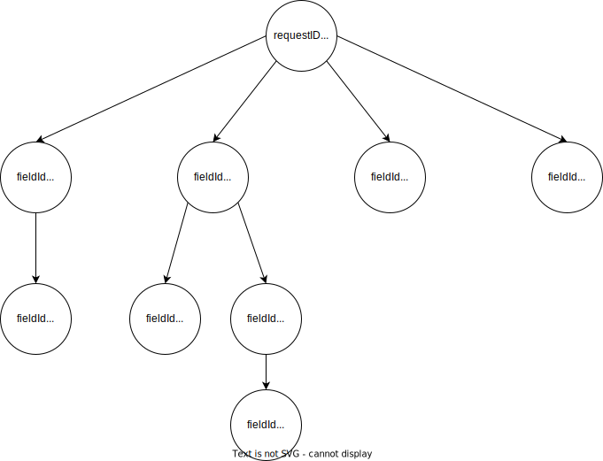

# Technology

This web-application is managed with Node.js.
Vite is used as a build tool and React is the library responsible for frontend rendering.

The following NPM-modules are installed:

| Modules                          | Purpose                                              |
| -------------------------------- | ---------------------------------------------------- |
| react                            | Frontend                                             |
| react-dom                        | Manipulation of dom                                  |
| react-error-boundary             | Library for error-handling in TSX-components         |
| react-hook-form                  | Framework which helps with state-management in forms |
| react-router-dom                 | Client-side routing by React                         |
| vite-plugin-checker              | Support for TSX linting and compilation              |
| @types/react                     | Types for TS for react                               |
| @types/react-dom                 | Types for TS for react-dom                           |
| @typescript-eslint/eslint-plugin | Eslint plugin for Typescript                         |
| @typescript-eslint/parser        | Typescript parser for eslint                         |
| @vite-pwa/assets-generator       | Generator for mandatory PWA-assets                   |
| @vitejs/plugin-react             | React compiler for vite                              |
| eslint                           | linter                                               |
| eslint-plugin-react-hooks        | Eslint plugin for react                              |
| eslint-plugin-react-refresh      | Eslint plugin for react                              |
| sass                             | Stylesheets                                          |
| typescript                       | Typescript                                           |
| vite                             | Built-tool                                           |
| vite-plugin-pwa                  | Vite plugin for PWA support                          |
| workbox-window                   | Vite plugin for offline caching capabilities         |

# Install

Dependencies can be installed on the command line via NPM. In the root directory run:

```bash
npm install
```

The following commands might be relevant as well:

```bash
npm run dev # Run development build on localhost
npm run build # Build app into outputfolder /dist
npm run preview # Run built app on localhost for testing
```

This app is deployed on Firebase and can be reached online at [net-acquiry.web.app](https://net-acquiry.web.app).
Firebase deployment to this URL can only be done by the owner of this repository and is not in scope for being explained here.

Note: Some PWA features might not work in the `npm run dev` mode. If you want to test PWA functionality, please build the project and run the preview.

# Intended use

This service should be used for requesting data from users. This can be done by providing a JSON object, which matches the format described later. Once provided the user will be forwarded to the "/request" page, which dynamically renders a form according to the provided JSON object. Once filled out, the user can submit the form. This prompts the app to generate a JSON-file, which is then ready to be posted to a backend.

### JSON-Input

The input file has to be structed like follows:

```json
{
  "requestId": number,
  "personalData": {
    "firstName": string,
    "lastName": string,
    "company": string
  },
  "requesterData": {
    "firstName": string,
    "lastName": string,
    "company": string,
    // OPTIONAL - Full URL or route on host-website
    "websiteLink": string,
    // OPTIONAL - Filename without path of image hosted in /img/requesters/...
    "pictureLink": string
  },
  // Array of one or more form fields, which will be dynamically rendered
  "requestContent": [
    {
	  // Index as if this was an array, starting at 0
      "fieldId": number,
      // Label for form field
      "fieldDescription": string,
      // OPTIONAL - Possible forms of input-type as described here:
      // https://developer.mozilla.org/en-US/docs/Web/HTML/Element/input
      "fieldType": "text" | "number" | "date" | "datetime-local" | "email" | "file" | "month" | "password" | "tel" | "time" | "url" | "week" | "color" | "radio" | "checkbox" | "select",
      // OPTIONAL - Additional parameters for form fields
      "fieldParams": {
	      // Note: Not every parameter is compatible with every type of input-tag - see docs!
	      // https://www.react-hook-form.com/api/useform/register/#options
		  "required": boolean, // Is this form field mandatory?
		  "maxLength": number, // Maximum length of input
		  "minLength": number, // Minimum length of input
		  "max": number, // Maximum value
		  "min": number, // Minimum value
		  "valueAsNumber": boolean, // Returns Number normally, NaN if returned value is no number
		  "valueAsDate": boolean, // Returns Date normally, Invalid Date if something goes wrong
		  "disabled": boolean, // Input value will always be undefined and control disabled
		  "shouldUnregister": boolean, // Data of item will be discarded if removed from view
		  "deps": string | string[] // Input validation according to values
      },
      // OPTIONAL - Input elements for a multi-select form-field.
      // Mandatory to be used if fieldType is "radio", "checkbox" or "select"
      "fieldValues": string[],
	  // OPTIONAL - Additional Array of sub-items with ID, Description, Type, ...
	  // Can be nested recursively indefinitely
      "fieldSubItems": [
	      {
		      // Same as before
	      }
      ]
    }
}
```

#### Examples:

#### Full form with one mandatory field

```json
{
	"requestId": 12345,
	"personalData": {
		"firstName": "Max",
		"lastName": "Mustermann",
		"company": "Muster GmbH"
	},

	"requesterData": {
		"firstName": "Mini",
		"lastName": "Musterfrau",
		"company": "Anfrage GmbH",
		"websiteLink": "https://fh-joanneum.at",
		"pictureLink": "woman.svg"
	},

	"requestContent": [
		{
			"fieldId": 0,
			"fieldDescription": "Birthname",
			"fieldType": "text",
			"fieldParams": {
				"required": true,
				"maxLength": 4,
				"value": "test"
			}
		}
	]
}
```

#### Form with nested fields

```json
{
  "requestId": 12345,
  "personalData": { // Data
  },
  "requesterData": { // Data
  },
  "requestContent": [
  {
      "fieldId": 0,
      "fieldDescription": "Just a label without value",
      "fieldSubItems": [
        {
          "fieldId": 0,
          "fieldDescription": "First input on layer two",
          "fieldType": "number"
        },
        {
          "fieldId": 1,
          "fieldDescription": "Second input on layer two",
          "fieldType": "number",
          "fieldSubItems": [
            {
              "fieldId": 0,
              "fieldDescription": "First input on layer three",
              "fieldType": "number",
              "fieldSubItems": [
                {
                  "fieldId": 0,
                  "fieldDescription": "First input on layer four",
                  "fieldType": "number",
                  "fieldSubItems": [
                    {
                      "fieldId": 0,
                      "fieldDescription": "First input on layer five",
                      "fieldType": "number",
                      "fieldSubItems": [
                        {
                          "fieldId": 0,
                          "fieldDescription": "First input on layer six",
                          "fieldType": "number"
                        }
                      ]
                    }
                  ]
                }
              ]
            }
          ]
        },
    }
  ]
}
```

#### Form with multi-select fields

```json
{
	"requestId": 12345,
	"personalData": {
		// Data
	},
	"requesterData": {
		// Data
	},
	"requestContent": [
		{
			"fieldId": 0,
			"fieldDescription": "Favorite word",
			"fieldType": "radio",
			"fieldValues": ["Mouse", "Giraffe", "Supercalifragilisticexpialigetisch"]
		},
		{
			"fieldId": 1,
			"fieldDescription": "Which food do you like?",
			"fieldType": "checkbox",
			"fieldValues": ["Mouse", "Giraffe", "Steak"],
			"fieldSubItems": [
				{
					"fieldId": 0,
					"fieldDescription": "What's your favorite?",
					"fieldType": "text"
				}
			]
		}
	]
}
```

### JSON-Output

The JSON-Output file is pretty much the same as the input.

```json
{
	// Same ID as the Input-JSON to identify the submission in the backend
	"requestID": number,
	"requestContent": [
	    {
			// Index as if this was an array, starting at 0
	        "fieldId": number,
	        // If nothing was entered or no entry was required, data will always be null
	        // Otherwise data is contained in field-data as the input-tags usually provide them
	        // (e.g. Input type "file" will provide a FileList object)
	        // Most data will however be strings and have to be parsed in the backend unless
	        // params like "valueAsNumber" or the like have been specified.
	        "fieldData": null | string | object,
	        // If the field hat sub-fields, this will contain an array with the nested fields
	        "fieldSubItems": null | [
		        // Array of fields, same structure as this one
	        ]
	    },
	    {
			// Another field
	    }
	]
}
```

#### Example

The idea is that the backend can correctly identify the data according to the request id and the field-IDs. Thus no additional context is required, which makes this form hard to read by a human.
Additional context was provided with comments.

```json
{
	"requestId": 21975,
	"requestContent": [
		{
			"fieldId": "0", // First field on layer one
			"fieldData": "Yes", // Text entry
			"fieldSubItems": [
				// Array means there's at least one subitem
				{
					"fieldId": "0", // First field on layer two
					"fieldData": {
						// File-type field
						"0": {
							// Contains file-data (not visible on copy)
						}
					},
					"fieldSubItems": null // null means no subitems
				}
			]
		},
		{
			"fieldId": "1", // Second field on layer one
			"fieldData": "2023-06-03", // Date-type field
			"fieldSubItems": [
				{
					"fieldId": "0", // First field on layer two
					"fieldData": "2023-06-15", // Date-type field
					"fieldSubItems": null
				},
				{
					"fieldId": "1",
					"fieldData": "2023-W26", // Week-type field
					"fieldSubItems": [
						{
							"fieldId": "0",
							"fieldData": "15:03", // time-type field
							"fieldSubItems": null
						}
					]
				}
			]
		},
		{
			"fieldId": "2",
			"fieldData": [
				// Checkbox-type field
				"labore",
				"velit"
			],
			"fieldSubItems": null
		},
		{
			"fieldId": "3",
			"fieldData": [
				// Checkbox-type field
				"nulla"
			],
			"fieldSubItems": null
		}
	]
}
```

As you can see the structure is very tree-like.
If you'd take the above example, the render as a tree would look like this:



Each node and leaf has their own data and they are connected via their subitems.

### Generate own JSON-input file

If you want to generate your own random data, you can go to https://json-generator.com/ and insert the template from the text-file "RandomGenTemplate.txt".
This can generate most possible variations.

# Customising looks

Application-specific styles are managed in multiple .sass files. General styles are handled at the bottom of index.sass in the root directory. Page-specific styles are managed in the .sass files which correspond to the individual .tsx files, which stand for routes. For example: The dynamic form is display on route "/request" which is handled via "request.tsx". "request.tsx" imports the stylesheet "request.sass". So any changes specific to the form have to be changed in "request.sass".
Conceptually each page is split into a header part with the logo and the main part for the content. For the dynamic display of content flexbox is used quite often, due to the very useful way it handles aligning content and wrapping on screen size changes.

The viewable area is managed via the root-element with ID "root" and serves as the base parent element in sass as well. Main and header have their own sass properties and children, where general styles for all pages are handled.

Route specific styles have, if required, their own specific classes, which are used for styling. All styles for the landing page can be customised via ".startContainer" and its children. The form and submission page mostly use the general defined style, with a fex exceptions. In the corresponding file you can find the class ".dynamicForm" which includes all styles which are relevant in the context of the dynamic form. In "submitted.sass" ".requester" can be found, which sets the properties for the component showing the contact person on the submission page.

# What might be missing?

At the current time there are some improvements or extensions that could be made. In no particular order:

- Integration with a backend
  - Adjusting input and output functions according to backend-needs
  - Multilanguage support
  - Offline availability (Keeping forms saved to be filled out later and making them available to be sent even without network)
  - Classes that translate common data types (like Integer, Double, Float, ...) to the corresponding HTML input fields and back
- Inclusion of help-modals to provide additional context for the forms
- Integration of a QR-Code Scanner which reads customized links
- Further data validation in front- and backend, and error-handling
